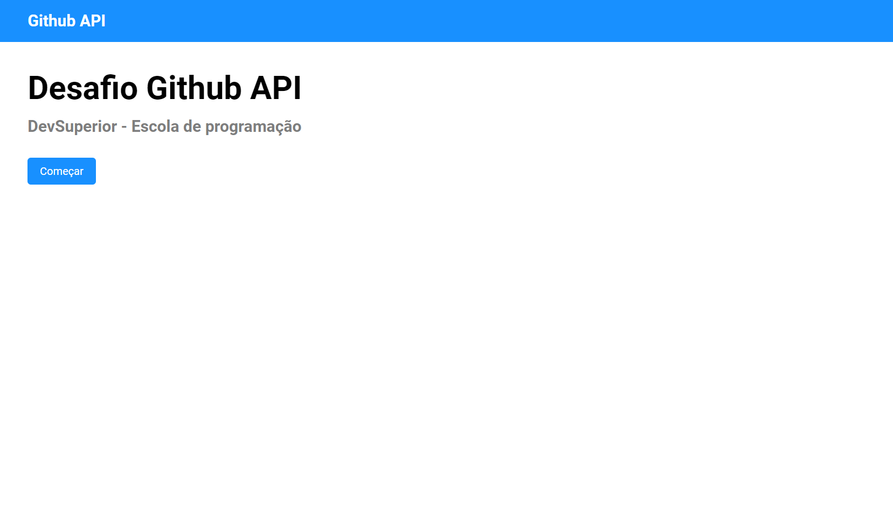
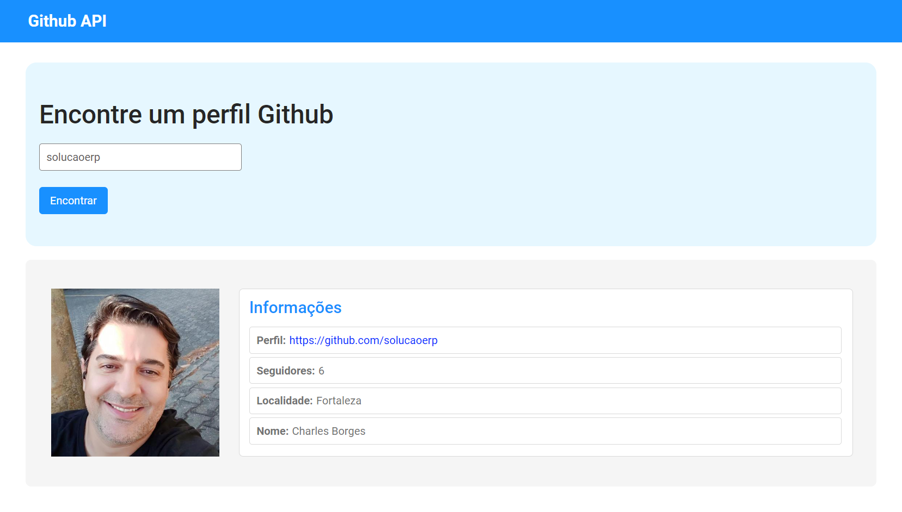
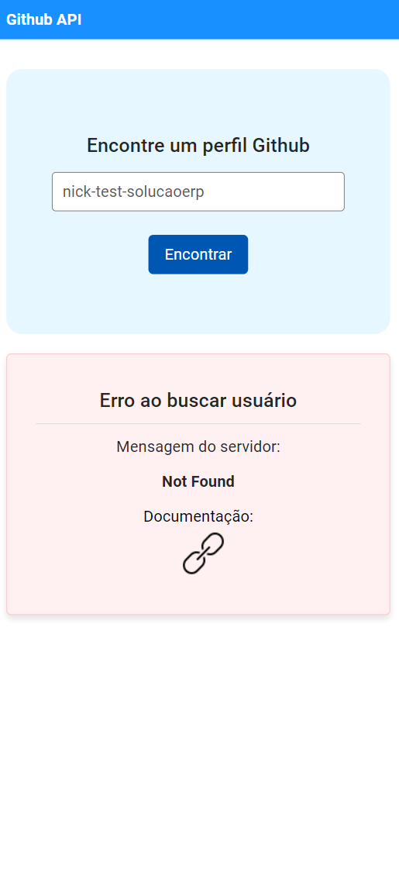

# Desafio: Github API

Este projeto é o resultado de um desafio que envolve a integração e consumo de dados `Github API`. Foi desenvolvido com as tecnologias [React](https://react.dev/), [TypeScript](https://www.typescriptlang.org/), [Vite](https://vitejs.dev/) e [Axios](https://axios-http.com/ptbr/docs/intro), exemplificando o desenvolvimento de aplicações frontend robustas e eficientes. Este trabalho é parte integrante do programa de treinamento **ReactJS Professional** da escola [DevSuperior](https://devsuperior.com.br/). Através dele, buscamos consolidar conhecimentos essenciais em `Componentes`, `Rotas` e na realização de `requisições HTTP com Axios`.

## 📸 Imagens do Projeto

### 📸 Visão Web

<div align="center">
  
  
</div>

### 📸 Visão Mobile

<div align="center">
  
  
  
  
</div>

## 🛠️ Tecnologias e Ferramentas Utilizadas

### Ambiente de Desenvolvimento:

- **[Node.js](https://nodejs.org/)**: Ambiente de execução JavaScript no servidor.
- **[VSCode](https://code.visualstudio.com/)**: Editor de código-fonte utilizado para desenvolvimento do projeto.

### Principais Tecnologias:

- **[React](https://react.dev/)**: Biblioteca JavaScript para construção de interfaces de usuário.
- **[Vite](https://vitejs.dev/)**: Ferramenta de construção que visa fornecer um meio mais rápido e eficiente de desenvolvimento para projetos modernos.
- **[TypeScript](https://www.typescriptlang.org/)**: Superset de JavaScript que adiciona tipagem estática.
- **[React Router Dom v6.4.1](https://reactrouter.com/)**: Biblioteca para gerenciamento de rotas em aplicações React.
- **[Axios v0.27.2](https://axios-http.com/ptbr/docs/intro)**: Utilizado para fazer requisições HTTP.

## 📦 Instalação e Uso

1. Primeiro, certifique-se de ter o `Node.js` instalado em sua máquina.
2. Clone o repositório para sua máquina.
3. Navegue até a pasta do projeto e execute o comando `yarn install` ou `npm install` para instalar todas as dependências.
4. Após a instalação, você pode iniciar o servidor de desenvolvimento com `yarn dev` ou `npm dev`.

## 📄 Tipos de Dados (Types)

Para garantir a integridade e a segurança dos dados ao trabalhar com TypeScript, definimos tipos específicos para lidar com as respostas da API do Github. Estes tipos ajudam a modelar a estrutura dos dados que esperamos receber, tanto para respostas bem-sucedidas quanto para erros.

### Tipo de Dados para Respostas Positivas:

Este tipo representa os dados do perfil do usuário que esperamos receber da API do Github quando a requisição é bem-sucedida.

Github API: `https://api.github.com/users`

```typescript
export type ProfileData = {
    avatar_url: string;
    login: string;
    html_url: string;
    followers: number;
    location: string;
    name: string;
};
```

O tipo `ProfileData` foi feito baseado no retorno abaixo:

```json
{
  "login": "solucaoerp",
  "id": 15080123,
  "node_id": "MDQ6VXNlcjE1MDgwMTIz",
  "avatar_url": "https://avatars.githubusercontent.com/u/15080123?v=4",
  "gravatar_id": "",
  "url": "https://api.github.com/users/solucaoerp",
  "html_url": "https://github.com/solucaoerp",
  "followers_url": "https://api.github.com/users/solucaoerp/followers",
  "following_url": "https://api.github.com/users/solucaoerp/following{/other_user}",
  "gists_url": "https://api.github.com/users/solucaoerp/gists{/gist_id}",
  "starred_url": "https://api.github.com/users/solucaoerp/starred{/owner}{/repo}",
  "subscriptions_url": "https://api.github.com/users/solucaoerp/subscriptions",
  "organizations_url": "https://api.github.com/users/solucaoerp/orgs",
  "repos_url": "https://api.github.com/users/solucaoerp/repos",
  "events_url": "https://api.github.com/users/solucaoerp/events{/privacy}",
  "received_events_url": "https://api.github.com/users/solucaoerp/received_events",
  "type": "User",
  "site_admin": false,
  "name": "Charles Borges",
  "company": null,
  "blog": "",
  "location": "Fortaleza",
  "email": null,
  "hireable": null,
  "bio": null,
  "twitter_username": null,
  "public_repos": 18,
  "public_gists": 0,
  "followers": 6,
  "following": 16,
  "created_at": "2015-10-11T22:33:15Z",
  "updated_at": "2023-09-27T23:08:55Z"
}
```

### Tipo de Dados para Respostas Negativas:

Quando ocorre um erro na requisição, a API do Github retorna uma mensagem de erro e uma URL de documentação. Definimos um tipo específico para lidar com essas respostas de erro.

```typescript
export type ErrorData = {
    message: string;
    documentation_url: string;
};
```

O tipo `ErrorData` foi feito baseado no retorno abaixo:

```json
{
  "message": "Not Found",
  "documentation_url": "https://docs.github.com/rest/users/users#get-a-user"
}
```

## 📜 Trechos de Código

### Definição de Rotas:

Neste trecho, definimos as rotas da aplicação utilizando o `React Router Dom`. A rota base ("/") leva à página inicial, enquanto a rota "/profile" leva à página de busca de perfis no Github.

```jsx
export default function App() {
  return (
    <BrowserRouter>
      <Routes>
        <Route path="/" element={<Home />} >
          <Route index element={<Welcome />} />
          <Route path="profile" element={<ProfileSearch />} />
        </Route>
      </Routes>
    </BrowserRouter>
  );
}
```

### Consumo da API Github:

Aqui, temos um exemplo de como a aplicação consome os dados da API do Github. Utilizando o `useEffect`, a aplicação busca os dados do perfil do usuário quando o estado `shouldFetch` é verdadeiro.

```jsx
export default function ProfileSearch() {
    // ... (código omitido para brevidade)
    useEffect(() => {
        if (shouldFetch) {
            fetchUserProfile(username)
                .then(data => {
                    setProfileData(data);
                    setErrorData(null);
                })
                .catch(error => {
                    // ... (tratamento de erros)
                });
            setShouldFetch(false);
        }
    }, [shouldFetch, username]);
    // ... (restante do componente)
}
```

### Serviço de Requisição:

Neste trecho, definimos a função `fetchUserProfile` que faz a requisição à API do Github para obter os dados do perfil do usuário. Em caso de erro, a função lança uma exceção com a mensagem de erro.

```javascript
import axios from 'axios';
import { BASE_URL } from '../utils/System';
import { ErrorData, ProfileData } from '../models/profileGithub';

export function fetchUserProfile(username: string) {
    return axios.get<ProfileData>(`${BASE_URL}/${username}`)
        .then(response => response.data)
        .catch(error => {
            if (axios.isAxiosError(error) && error.response) {
                throw error.response.data as ErrorData;
            }
            throw new Error("Erro desconhecido ao buscar perfil do usuário.");
        });
}
```

### Tratamento de Erros:

Aqui, temos um componente que exibe mensagens de erro ao usuário. Ele é utilizado para informar ao usuário sobre possíveis erros ao buscar um perfil no Github.

```jsx
export default function RequestErrorAlert({ errorData }: RequestErrorAlertProps) {
    const { message, documentation_url } = errorData;
    // ... (restante do componente)
}
```

## 📄 Licença

Este projeto está licenciado sob os termos da [Licença MIT](https://opensource.org/licenses/MIT). A Licença MIT é uma licença de software livre e de código aberto que permite o uso, a cópia, a modificação e a distribuição do código-fonte. Esta licença é notória por sua simplicidade e flexibilidade, incentivando a colaboração e a inovação no software de código aberto.